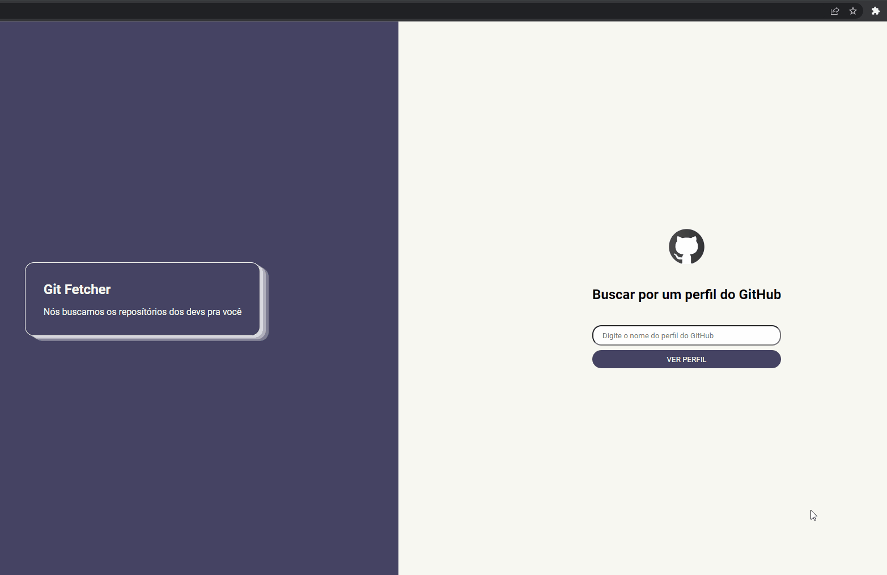
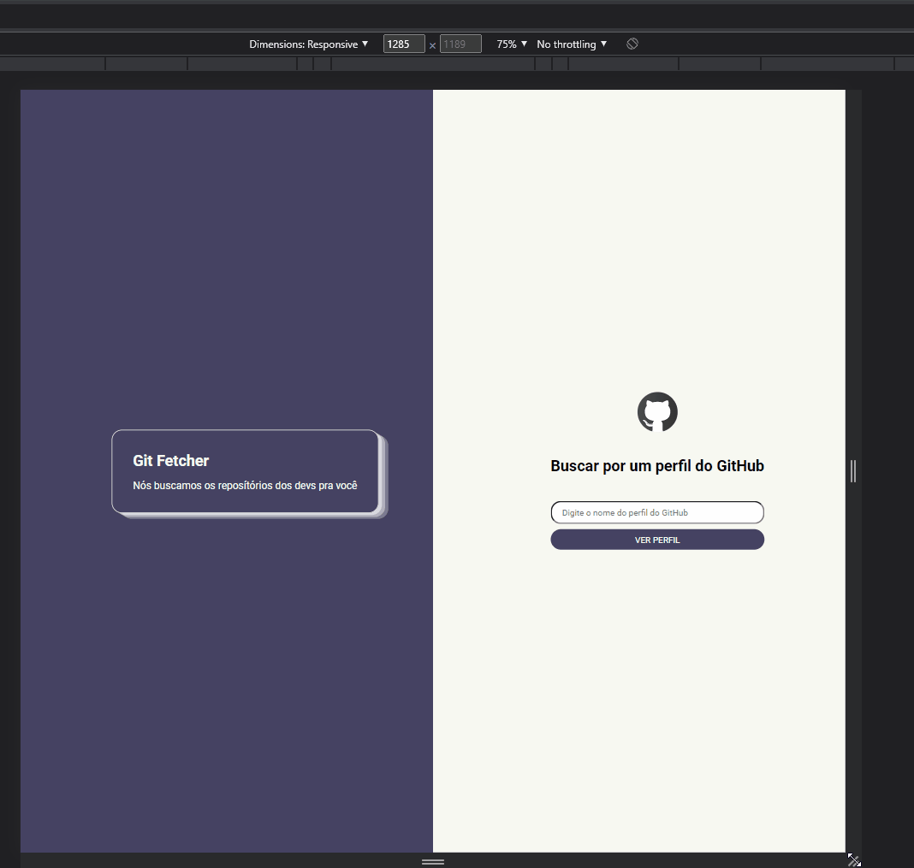

# Projeto GitFetcher

### Consumindo a API do GitHub, implementei esse projeto que é uma página onde você pode buscar por perfis de devs/usuários do GitHub e obter informações do perfil e repositórios.

👀 Dá uma olhada aqui: <https://thiago-levi.github.io/projeto-git-fetcher>

Infos:

- Exibe um card com informações de perfil:
  - Foto do perfil
  - Nome do perfil
  - Bio do perfil
- Exibe informações de todos os respositórios públicos do usuário.
  - Nome do repositório
  - Descrição do repositório
  - Linguagem principal do repositório

Infos extras:

- Implementei a resposividade da página

## Tecnologias

  

---

<h2 align="center">Versão Web</h2>

 
___

<h2 align="center">Versão Mobile</h2>

